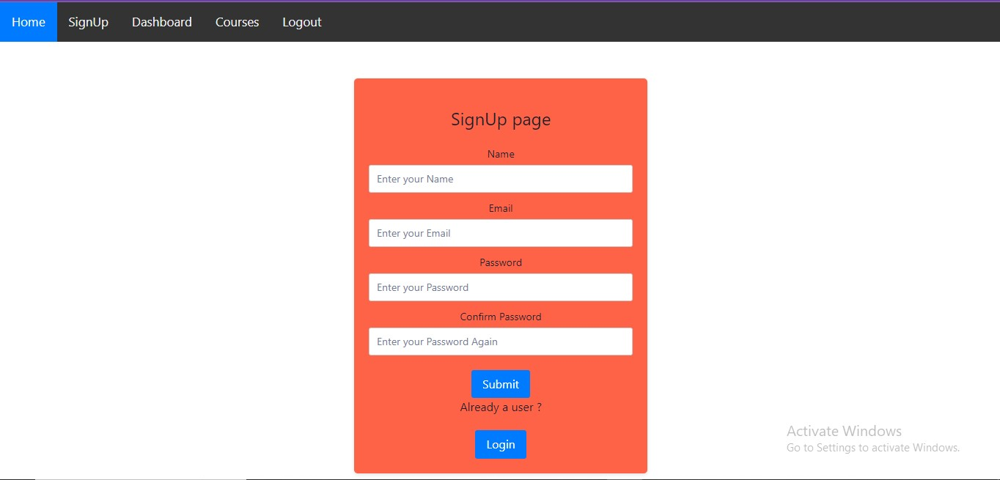
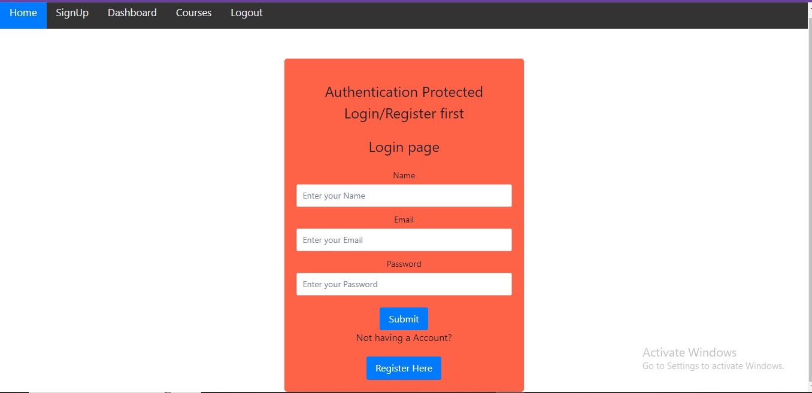
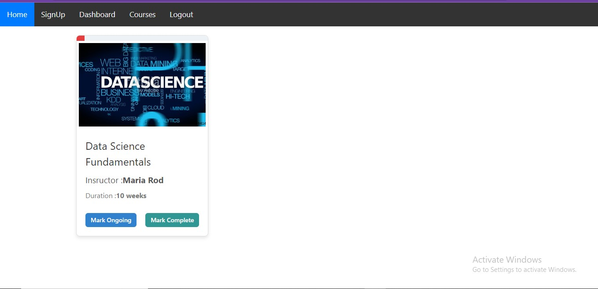
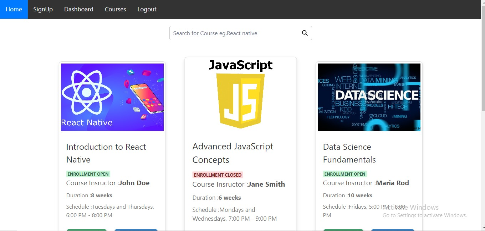
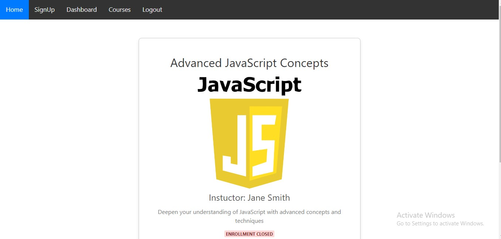

# Alemeno_Assesment-Front_end

# LMS Web Application README

This is small LMS  web application consists of a frontend and a backend.This web application is full responsive on all the Devices such as Large, Medium and Small Screens Below are instructions on how to run each part of the application.

## Backend

The backend of the application is built using JSON Server  To run the backend server, follow these steps:

1. Open your terminal or command prompt.

2. Install the required dependencies by running:  **npm install**

3. Start the backend server using the following command:  **npm run server**

The server will start and listen for requests on port 8080 by default. You can access the backend API at `http://localhost:8080/courses` & `http://localhost:8080/users`.

## Frontend

The frontend of the application is built using React.js. To run the frontend development server, follow these steps:

1. Open another terminal or command prompt window (keep the backend server running in the previous window).

2. Start the frontend development server using the following command: **npm run start**

3. It uses **PATCH** request as well as **POST** request.

4. It has the **Protected Route**  with **Auth Guard**  for all the Routing.

## Using the App

1. Go on and Register Yourself or otherwise if you are previosly register  login yourself

2. When you Register Successfully you are redirected to Dashboard with enrolled Courses if you have enrolled or otherwise it will show no Courses enrolled please enrolled from Course Page

3. Check For the Coures available in Courses section and enroll for the Course available

4. You can also view the Course Details by Clicking on view Details Button

5. Finally you can logout by Clicking on the Logout section, you will be Redirected to Homepage